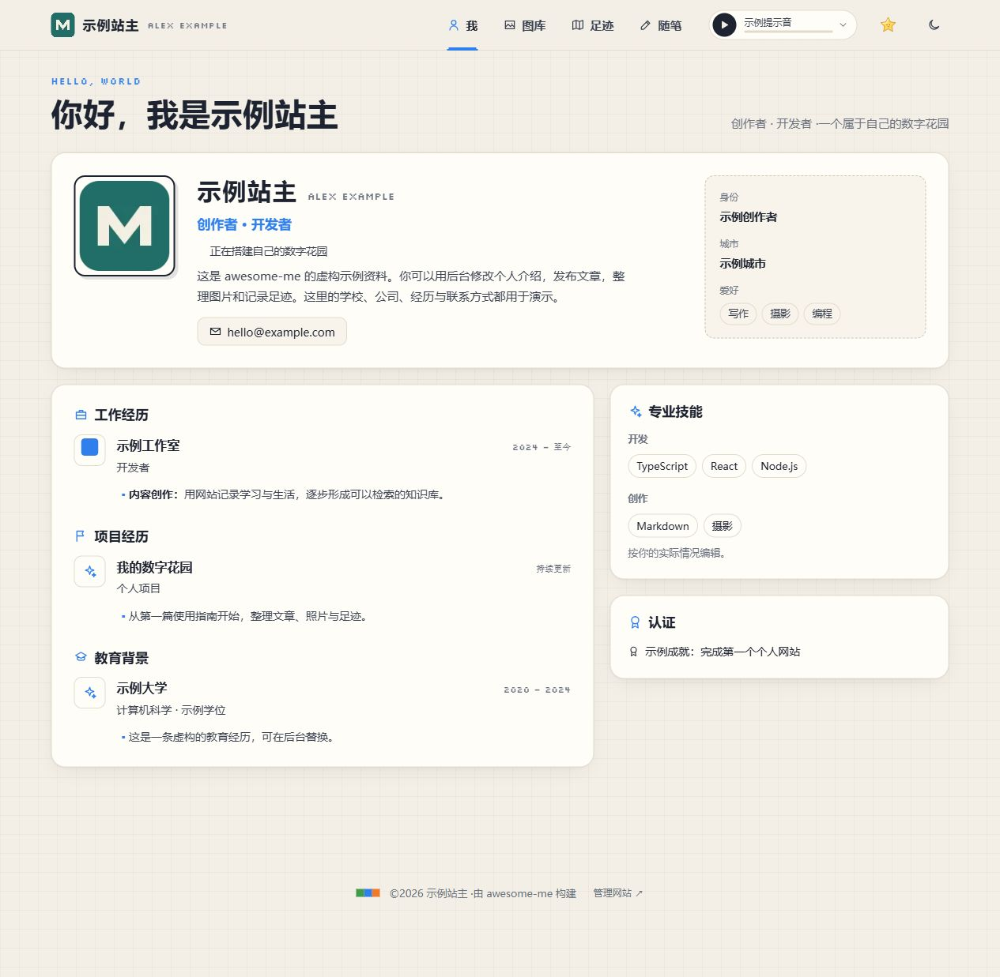
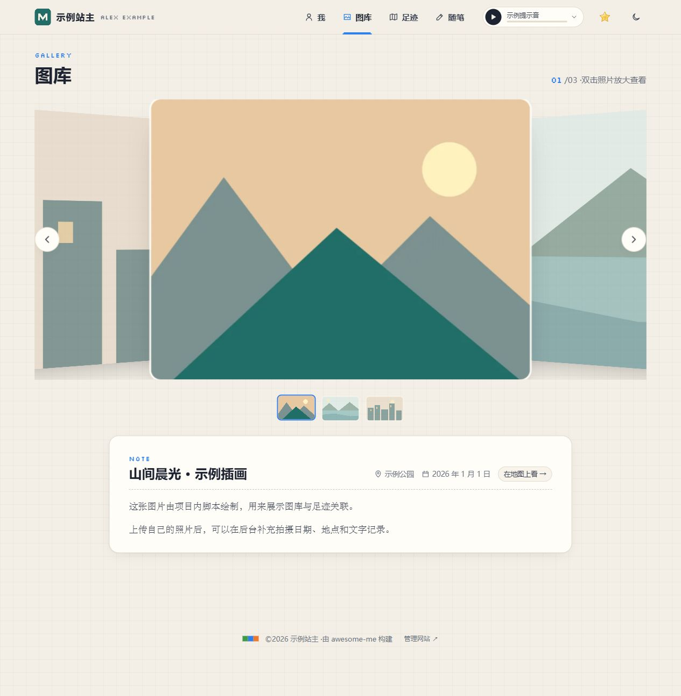
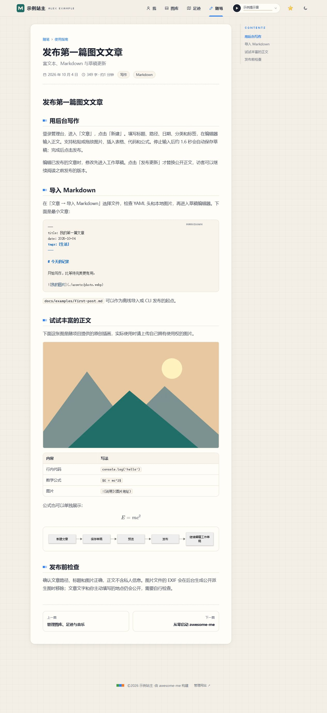
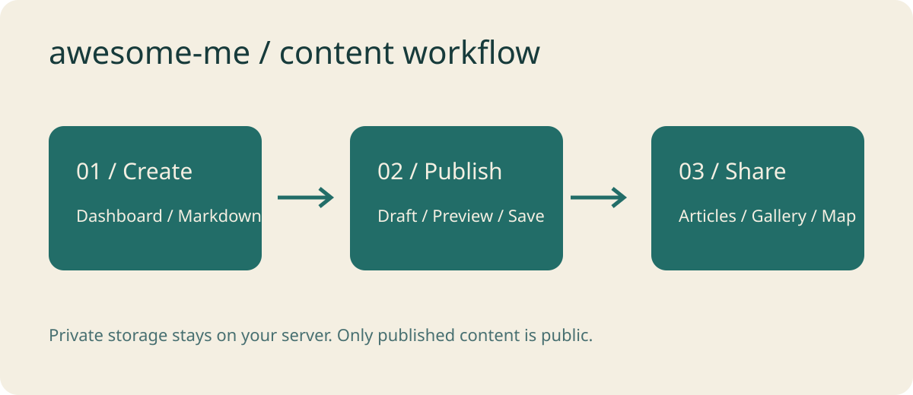

# awesome-me

一个可以自托管的个人网站与内容工作室：介绍自己，发布图文文章，整理图库、足迹和音乐。基于 React、Vite、Fastify 和 SQLite，支持管理后台、CLI 与 AI Skill。

公开项目仅包含**虚构资料和原创示例素材**。小游戏与像素动画默认关闭，可以在后台开启。



<details>
<summary>查看图库与图文文章截图</summary>

图库展示照片、文字记录和关联足迹：



文章支持图片、代码、表格、数学公式和 Mermaid 图：



</details>

以上均为项目自带示例数据的实际页面截图。

## 五分钟开始

需要 **Node.js 24.14–24.x**。在项目根目录运行：

```powershell
npm ci
Copy-Item .env.server.example .env.server
npm run content:migrate
npm run owner:init
npm run dev:full
```

已有 `.env.server` 时保留原文件。公开网站：[localhost:5173](http://localhost:5173/)。管理台：[localhost:5173/#/admin](http://localhost:5173/#/admin)。初始化时自行设置唯一站主账号与密码，没有默认密码和公开注册。

首次导入后，在后台编辑资料、文章和媒体。重复执行 `content:migrate` 会保留已编辑记录。高德地图可选，未配置密钥时使用离线示意图。

FFmpeg 安装需要下载平台二进制；网络受限时，可在安装前设置 `FFMPEG_BIN` 为本机已有 FFmpeg 的绝对路径，运行时也保留此配置。Docker 镜像使用系统 FFmpeg。

## 高德地图配置（可选）

**每位部署者申请并使用自己的高德凭据**。仓库只提供空模板，不包含作者的 Key。无需在线地图时，三项留空即可：网站使用离线足迹示意图，地点仍可手动填写。

在[高德开放平台控制台](https://console.amap.com/)注册开发者、创建应用，然后分别添加两种 Key：

| 配置项 | 在高德申请什么 | 本项目用途 |
| --- | --- | --- |
| `AMAP_WEB_KEY` | 服务平台为「Web端（JS API）」的 Key | 公开页面的在线互动地图 |
| `AMAP_SECURITY_CODE` | 与上面同一个 JS API Key 配套的安全密钥（jscode） | 服务端地图代理，不能用 Web 服务 Key 代替 |
| `AMAP_SERVICE_KEY` | 服务平台为「Web服务」的另一枚 Key | 后台地点搜索、逆地理编码与 GPS 坐标转换 |

申请步骤见高德官方的 [JS API 准备指南](https://lbs.amap.com/api/javascript-api-v2/prerequisites)与 [Web 服务 Key 指南](https://lbs.amap.com/api/webservice/create-project-and-key)。在线地图需要前两项配套，后台地点查询使用第三项。

把凭据填进项目根目录的 `.env.server`，保存后重启 API 服务（开发模式重新运行 `npm run dev:full`，生产模式重启 Node 服务或应用容器）。在高德控制台按实际部署域名设置 Web Key 的域名白名单。

`.env.server` 已被 Git 忽略。Web 服务 Key 和安全密钥仅由服务端使用，项目已内置[高德推荐的安全代理](https://lbs.amap.com/api/javascript-api-v2/guide/abc/jscode)；JS API 的 Web Key 会提供给浏览器。所有凭据都不要写进文章、README、公开源码或 `VITE_` 环境变量。

## 从示例学会使用



网站自带 4 篇可编辑的图文指南，也可在这里直接阅读：

- [启动网站与初始化](public/content/essays/使用指南/getting-started/index.md)
- [发布第一篇图文文章](public/content/essays/使用指南/writing/index.md)
- [管理图库、足迹与音乐](public/content/essays/使用指南/gallery-and-map/index.md)
- [CLI 与 AI 发布](public/content/essays/使用指南/ai-publishing/index.md)

可直接导入的文章模板：[first-post.md](docs/examples/first-post.md)。更多操作见[内容指南](docs/CONTENT_GUIDE.md)。

## 入口保持简单

只保留 5 个源码文件夹；安装后的 `node_modules` 是第 6 个普通文件夹。Git 元数据目录隐藏，运行数据与构建产物放在现有目录内部。

| 文件夹 | 用途 |
| --- | --- |
| `src/` | 网站界面、共享协议、虚构初始资料 |
| `server/` | API、账号、数据库与媒体服务 |
| `public/` | 原创演示插画、提示音与示例文章 |
| `docs/` | 部署说明、使用说明与文章模板 |
| `tools/` | CLI、脚本、构建工具、测试、AI Skill 与部署附件 |

`server/.local/` 保存私有运行数据，`public/.build/` 保存构建输出，二者都被 Git 与 Docker 构建上下文忽略。

## 部署与维护

停止开发服务，将 `.env.server` 的 `SITE_ORIGIN` 改为 `http://localhost:3001`，然后：

```powershell
npm run build
npm start
```

正式部署用 HTTPS 域名作为 `SITE_ORIGIN`。这是完整的 Node 服务，构建输出需要配合 API 运行。Docker、备份与恢复见[部署说明](docs/DEPLOYMENT.md)，实现结构见[架构说明](docs/ARCHITECTURE.md)。

```powershell
npm run check:release
```

发布检查包括类型检查、回归测试、生产构建、客户端密钥检查，以及待提交文件的隐私检查。发布自己的版本前请阅读[公开数据边界](docs/PRIVACY.md)。

## 贡献与许可

欢迎提交 Issue 和 Pull Request。见[贡献说明](CONTRIBUTING.md)与[安全问题处理](SECURITY.md)。代码、原创演示插画、合成音频及示例文字采用 [MIT License](LICENSE)。依赖项保留各自许可证，见[素材与依赖说明](docs/ASSETS.md)。
