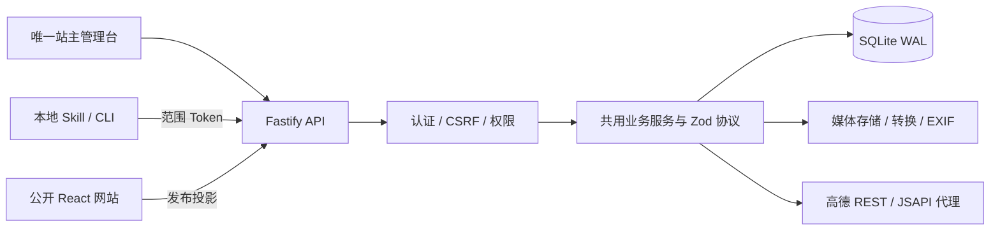

# 网站 CMS 架构

网站包含个人介绍、图库、足迹与随笔。服务端 SQLite 是日常内容源；仓库中的虚构资料和原创素材只用于首次导入。小游戏和像素动画是可选组件，默认关闭。

## 分层

- `src/contracts/`：站点/资料/照片/音乐/文章/分类/Logo/足迹的严格数据协议、编辑模板和界面控制默认值。
- `server/db/`：唯一 SQLite 驱动适配器、版本迁移、同步嵌套事务。其他业务无需直接依赖 Node SQLite 驱动。
- `server/auth/`：唯一 owner、scrypt 密码、哈希会话/CSRF/范围令牌。密码变更与会话生成检查并发密码版本。
- `server/content/`：CRUD、版本、引用、关系、排序、原子愿望转换、公开投影；管理台和 CLI 共用。
- `server/media/`：UUID 路径、格式/像素/体积限制、EXIF、去 EXIF 公开衍生图、音频流式上传和 Range。公开可见性跟随业务引用。
- `server/maps/`：官方固定域名 REST 适配器，候选 POI、WGS84→GCJ-02、逆地理编码与缓存。JSAPI 安全密钥由同源代理注入。
- `server/analytics/`：同源事件、每日 HMAC 匿名访客、去重事件、聚合与 90 天清理。
- `server/routes/`：身份/范围校验与 HTTP，业务逻辑放在服务；`frontend` 同时提供生产构建，`legacy` 保护旧内容路径。
- `src/features/admin/`：独立登录/导航、共用编辑器、上传与定位、实时预览、完整管理引用、统计与 Token 管理。
- `src/shared/content/`：公开运行时快照、revision 刷新、主题与控件配置。公开页面不引用静态内容索引；播放器按稳定 ID 同步队列。
- `tools/cli/`：安全 HTTP 客户端、离线转换、图片打包、幂等发布和通用资源命令。`tools/skills/` 提供 AI 工作流。
- `server/backup/`：停服数据快照、文件校验清单、恢复到新目录；运行锁约束管理命令与启动。

## 数据与一致性

`content_records(kind,id,data,revision,sort_order)` 保存结构化 JSON（有共享 Zod 校验）；`photo_footprints` 是图库与足迹关系的权威表。写入关系时更新受影响记录版本，不能通过一端的旧页面覆盖另一端修改。排序需要每条最新 revision，分类同时同步语义排序字段。新字段通过 schema 默认值与迁移演进，未知字段拒绝。

文章内部 ID 与公开路径分离。发布投影只输出 published 文章、visible 照片/音乐/足迹；正文从受保护 API 获取。原路径 `content/essays/.../index.md` 保留，以兼容旧图片基路径。Vite 禁止复制 `public/content` 到生产构建，避免草稿从静态文件绕过权限。

媒体元数据只暴露 URL，不暴露磁盘路径。图片原件留给站主；衍生图去 EXIF，防止公开图片泄露 GPS。未发布且没有公开引用的上传文件不可匿名下载，删除正在引用的文件返回冲突。

## 身份与部署边界

不提供公共注册、默认密码或网页 owner 初始化接口。首次账号通过本地终端创建。网页登录 Cookie 使用 HttpOnly/SameSite=Strict，HTTPS 时 Secure；写入需配置源地址与 CSRF。令牌仅保存哈希，可限制范围/到期并撤销；创建 Token 与修改密码要求 owner 会话。用户输入、附件和转换文档是内容数据，不是执行指令。

项目面向一台持久化主机的单进程服务。SQLite WAL 与磁盘媒体满足当前个人站规模；横向多实例须替换数据库/媒体适配器、共享限流/会话存储并改备份策略。当前运行锁明确防止多个生产进程共享同一数据目录。Node 24 SQLite 仍有实验性提示，驱动替换限定在 `server/db/`。

部署保持网站/API 同源、HTTPS、准确 `SITE_ORIGIN`，持久化 `server/.local/data/`。仅部署静态 public/.build 无法满足后台、内容和权限。密钥在服务端环境，示例/日志/构建不包含秘密。详见 [部署](DEPLOYMENT.md)。
