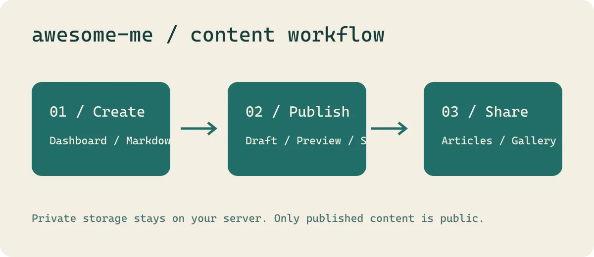

# 从零启动 awesome-me

awesome-me 把个人介绍、文章、图库与足迹放在一个可自托管的网站里。你现在看到的资料、地点和插画都是演示内容，可以随时在后台替换。



上图是项目的流程示意图：准备内容 → 在后台预览发布 → 在公开网站阅读。数据库、账号和原图保存在自己的服务器上。

## 1. 安装和初始化

需要 Node.js 24.14–24.x。在项目根目录运行：

```powershell
npm ci
Copy-Item .env.server.example .env.server
npm run content:migrate
npm run owner:init
npm run dev:full
```

已有 `.env.server` 时保留原文件。`content:migrate` 将这组示例导入数据库，重复执行会保留后台已编辑的记录。`owner:init` 在本地设置你自己的账号与密码，没有默认密码或公开注册。

如果安装时 FFmpeg 下载受网络限制，可以先设置 `FFMPEG_BIN` 为本机已安装的 FFmpeg 的绝对路径，再执行 `npm ci`；运行应用时也保留该配置。

## 2. 打开网站和管理台

公开网站是 [localhost:5173](http://localhost:5173/)，管理台是 [localhost:5173/#/admin](http://localhost:5173/#/admin)。用刚创建的账号登录。

进入「我 · 可视化编辑」，修改姓名、简介、头像和联系方式。预览中可以点击文字定位到对应字段；完成后点击「保存到网站」。

## 3. 理解内容保存位置

| 位置 | 作用 |
| --- | --- |
| `src/data/` | 初次导入的虚构示例资料 |
| `public/content/` | 本篇指南、图库插画和示例提示音 |
| `server/.local/data/` | 运行数据库、上传媒体、账号和草稿，不进入 Git |

初次导入后，日常编辑通过后台或 CLI 完成。修改源码中的示例不会覆盖后台现有内容。

## 4. 开启可选功能

小游戏和像素动画默认关闭。在后台「我 · 可视化编辑」的快捷设置中找到「小游戏与像素人 · 显示开关」，按需要开启并保存。

高德地图是可选项。不配置密钥时，足迹仍可使用离线示意图和手动坐标；需要在线地图时，在 `.env.server` 填入自己的配置。

接下来阅读「发布第一篇图文文章」，实际走一遍写作与发布。
